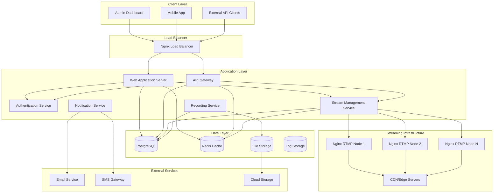

# Design Document

## Overview

The Multi-Camera Streaming Platform is a comprehensive solution for managing RTMP camera streams with real-time monitoring, recording capabilities, and API integration. The system follows a microservices architecture with separate concerns for streaming, web application, and API services, ensuring scalability and maintainability.

### Key Design Principles

- **Scalability**: Horizontal scaling support for handling 100+ cameras
- **Security**: Multi-layered security with JWT authentication, API tokens, and role-based access
- **Real-time**: WebSocket connections for live dashboard updates and stream monitoring
- **Modularity**: Microservices architecture allowing independent scaling and deployment
- **Performance**: Optimized streaming pipeline with CDN support and adaptive bitrate

## Architecture

### High-Level Architecture



### Technology Stack

**Backend Services:**
- **Node.js with NestJS**: Main application framework for scalability and TypeScript support
- **PostgreSQL**: Primary database for structured data (cameras, users, recordings, tokens)
- **Redis**: Caching layer and session storage for performance
- **Nginx with RTMP Module**: Streaming server for RTMP ingestion and HLS output

**Frontend:**
- **React 18 with TypeScript**: Modern UI framework with type safety
- **TailwindCSS + shadcn/ui**: Utility-first CSS with pre-built components
- **React Query (TanStack Query)**: Data fetching and caching
- **Socket.io Client**: Real-time updates for dashboard

**Streaming & Media:**
- **Nginx RTMP Module**: RTMP/RTMPS stream ingestion and processing
- **FFmpeg**: Video processing, format conversion, and adaptive bitrate encoding
- **WebRTC**: Ultra low-latency streaming for real-time monitoring
- **HLS.js**: Browser-based HLS video playback with adaptive bitrate
- **Video.js**: Advanced video player with timeline controls and playback features

**Infrastructure:**
- **Kubernetes**: Container orchestration with Horizontal Pod Autoscaler (HPA)
- **Docker & Docker Compose**: Containerization for development and deployment
- **Prometheus + Grafana**: Monitoring, metrics, and stream analytics
- **ELK Stack**: Centralized logging (Elasticsearch, Logstash, Kibana)
- **Redis Cluster**: High-availability caching and session management

## Components and Interfaces

### 1. Authentication Service

**Purpose**: Centralized authentication and authorization management

**Key Features:**
- JWT token generation and validation
- Role-based access control (RBAC)
- API token management
- Session management with Redis

**Interfaces:**
```typescript
interface AuthService {
  login(credentials: LoginDto): Promise<AuthResponse>
  validateToken(token: string): Promise<UserPayload>
  generateApiToken(userId: string, permissions: Permission[]): Promise<ApiToken>
  revokeToken(tokenId: string): Promise<void>
  refreshToken(refreshToken: string): Promise<AuthResponse>
}

interface UserPayload {
  id: string
  username: string
  role: UserRole
  permissions: Permission[]
}

enum UserRole {
  ADMIN = 'admin',
  OPERATOR = 'operator',
  VIEWER = 'viewer',
  API_ONLY = 'api_only'
}
```

### 2. Stream Management Service

**Purpose**: Core service for managing camera streams and RTMP infrastructure

**Key Features:**
- Camera CRUD operations with multi-tenant support
- RTMPS (TLS-encrypted) link generation and validation
- Real-time stream health monitoring (FPS, bitrate, dropped frames)
- Automatic load balancing and node orchestration
- Adaptive bitrate encoding for multiple quality levels
- WebRTC support for ultra low-latency streaming

**Interfaces:**
```typescript
interface StreamService {
  createCamera(cameraData: CreateCameraDto): Promise<Camera>
  updateCamera(id: string, updates: UpdateCameraDto): Promise<Camera>
  generateRtmpUrl(camera: Camera): string
  getStreamStatus(cameraId: string): Promise<StreamStatus>
  distributeStream(cameraId: string): Promise<RtmpNode>
}

interface Camera {
  id: string
  name: string
  company: string
  model: string
  serialNumber: string
  location: string
  place: string
  rtmpUrl: string
  isActive: boolean
  isRecording: boolean
  streamStatus: StreamStatus
  createdAt: Date
  updatedAt: Date
}

enum StreamStatus {
  ONLINE = 'online',
  OFFLINE = 'offline',
  CONNECTING = 'connecting',
  ERROR = 'error'
}
```

### 3. Recording Service

**Purpose**: Manages video recording, storage, and retrieval

**Key Features:**
- Segmented recording (1-hour chunks) for better management
- Automatic retention policies with cold storage archival
- Multi-tier storage (SSD → HDD → Cloud)
- Recording metadata with timeline indexing
- Crash-resistant recording with automatic recovery
- Signed URL generation for secure recording access

**Interfaces:**
```typescript
interface RecordingService {
  startRecording(cameraId: string): Promise<void>
  stopRecording(cameraId: string): Promise<void>
  getRecordings(filters: RecordingFilters): Promise<Recording[]>
  deleteRecording(recordingId: string): Promise<void>
  archiveToCloud(recordingId: string): Promise<void>
  applyRetentionPolicy(): Promise<void>
}

interface Recording {
  id: string
  cameraId: string
  filename: string
  duration: number
  fileSize: number
  startTime: Date
  endTime: Date
  isArchived: boolean
  cloudUrl?: string
}
```

### 4. Notification Service

**Purpose**: Handles real-time notifications and alerts

**Key Features:**
- WebSocket connections for real-time updates
- Email and SMS notifications
- Alert management and escalation
- Notification preferences

**Interfaces:**
```typescript
interface NotificationService {
  sendRealTimeUpdate(userId: string, update: RealtimeUpdate): Promise<void>
  sendAlert(alert: Alert): Promise<void>
  configureNotificationPreferences(userId: string, preferences: NotificationPreferences): Promise<void>
  getAlertHistory(filters: AlertFilters): Promise<Alert[]>
}

interface Alert {
  id: string
  type: AlertType
  severity: AlertSeverity
  message: string
  cameraId?: string
  timestamp: Date
  acknowledged: boolean
}

enum AlertType {
  CAMERA_OFFLINE = 'camera_offline',
  RECORDING_FAILED = 'recording_failed',
  STORAGE_FULL = 'storage_full',
  API_RATE_LIMIT = 'api_rate_limit'
}
```

### 5. API Gateway

**Purpose**: Unified entry point for external API access

**Key Features:**
- Request routing and load balancing
- Rate limiting and throttling
- API token validation
- Request/response logging

**API Endpoints:**
```typescript
// Camera Management
GET    /api/v1/cameras
GET    /api/v1/cameras/:id
POST   /api/v1/cameras
PUT    /api/v1/cameras/:id
DELETE /api/v1/cameras/:id

// Stream Access
GET    /api/v1/cameras/:id/stream/hls
GET    /api/v1/cameras/:id/stream/webrtc
GET    /api/v1/cameras/:id/status
GET    /api/v1/cameras/:id/analytics

// Recording Management
GET    /api/v1/recordings
GET    /api/v1/recordings/:id
DELETE /api/v1/recordings/:id
GET    /api/v1/recordings/:id/signed-url
GET    /api/v1/recordings/timeline/:cameraId

// Token Management
POST   /api/v1/tokens
GET    /api/v1/tokens
DELETE /api/v1/tokens/:id
PUT    /api/v1/tokens/:id/permissions

// Analytics & Monitoring
GET    /api/v1/analytics/dashboard
GET    /api/v1/analytics/cameras/:id/metrics
GET    /api/v1/analytics/storage/usage
```

## Data Models

### Database Schema

**Users Table:**
```sql
CREATE TABLE users (
    id UUID PRIMARY KEY DEFAULT gen_random_uuid(),
    username VARCHAR(50) UNIQUE NOT NULL,
    password_hash VARCHAR(255) NOT NULL,
    role user_role NOT NULL DEFAULT 'viewer',
    is_active BOOLEAN DEFAULT true,
    created_at TIMESTAMP DEFAULT CURRENT_TIMESTAMP,
    updated_at TIMESTAMP DEFAULT CURRENT_TIMESTAMP
);
```

**Cameras Table:**
```sql
CREATE TABLE cameras (
    id UUID PRIMARY KEY DEFAULT gen_random_uuid(),
    name VARCHAR(100) NOT NULL,
    company VARCHAR(100) NOT NULL,
    model VARCHAR(100) NOT NULL,
    serial_number VARCHAR(100) UNIQUE NOT NULL,
    location VARCHAR(200) NOT NULL,
    place VARCHAR(200) NOT NULL,
    rtmp_url VARCHAR(500) NOT NULL,
    rtmp_key VARCHAR(100) NOT NULL,
    is_active BOOLEAN DEFAULT true,
    is_recording BOOLEAN DEFAULT false,
    stream_status stream_status DEFAULT 'offline',
    assigned_node VARCHAR(100),
    created_at TIMESTAMP DEFAULT CURRENT_TIMESTAMP,
    updated_at TIMESTAMP DEFAULT CURRENT_TIMESTAMP
);
```

**API Tokens Table:**
```sql
CREATE TABLE api_tokens (
    id UUID PRIMARY KEY DEFAULT gen_random_uuid(),
    user_id UUID REFERENCES users(id),
    token_hash VARCHAR(255) NOT NULL,
    name VARCHAR(100) NOT NULL,
    remark TEXT,
    permissions JSONB NOT NULL,
    rate_limit INTEGER DEFAULT 1000,
    expires_at TIMESTAMP,
    last_used_at TIMESTAMP,
    is_active BOOLEAN DEFAULT true,
    created_at TIMESTAMP DEFAULT CURRENT_TIMESTAMP
);
```

**Recordings Table:**
```sql
CREATE TABLE recordings (
    id UUID PRIMARY KEY DEFAULT gen_random_uuid(),
    camera_id UUID REFERENCES cameras(id),
    segment_number INTEGER NOT NULL,
    filename VARCHAR(255) NOT NULL,
    file_path VARCHAR(500) NOT NULL,
    duration INTEGER NOT NULL, -- in seconds
    file_size BIGINT NOT NULL, -- in bytes
    start_time TIMESTAMP NOT NULL,
    end_time TIMESTAMP NOT NULL,
    storage_tier storage_tier DEFAULT 'hot', -- hot, warm, cold
    is_archived BOOLEAN DEFAULT false,
    cloud_url VARCHAR(500),
    signed_url_expires_at TIMESTAMP,
    created_at TIMESTAMP DEFAULT CURRENT_TIMESTAMP,
    INDEX idx_camera_time (camera_id, start_time),
    INDEX idx_storage_tier (storage_tier, created_at)
);

CREATE TYPE storage_tier AS ENUM ('hot', 'warm', 'cold', 'archived');
```

### Redis Data Structures

**Session Storage:**
```
Key: session:{sessionId}
Value: {userId, role, permissions, expiresAt}
TTL: 24 hours
```

**Stream Status Cache:**
```
Key: stream:status:{cameraId}
Value: {status, lastSeen, nodeId, viewerCount, fps, bitrate, droppedFrames, resolution}
TTL: 30 seconds
```

**Stream Analytics:**
```
Key: analytics:camera:{cameraId}:{date}
Value: {totalUptime, avgBitrate, peakViewers, recordingSize}
TTL: 30 days
```

**Viewer Sessions:**
```
Key: viewers:{cameraId}
Value: Set of {sessionId, joinTime, userAgent}
TTL: 1 hour
```

**Rate Limiting:**
```
Key: rate_limit:{tokenId}:{window}
Value: requestCount
TTL: 1 hour
```

## Error Handling

### Error Response Format

```typescript
interface ErrorResponse {
  success: false
  error: {
    code: string
    message: string
    details?: any
    timestamp: string
    requestId: string
  }
}
```

### Error Categories

**Authentication Errors (401):**
- `AUTH_TOKEN_INVALID`: Invalid or expired JWT token
- `AUTH_TOKEN_MISSING`: Authorization header missing
- `AUTH_CREDENTIALS_INVALID`: Invalid username/password

**Authorization Errors (403):**
- `AUTH_INSUFFICIENT_PERMISSIONS`: User lacks required permissions
- `AUTH_ROLE_RESTRICTED`: Action restricted to specific roles

**Validation Errors (400):**
- `VALIDATION_FAILED`: Request data validation failed
- `CAMERA_SERIAL_DUPLICATE`: Serial number already exists
- `CAMERA_NOT_FOUND`: Camera ID not found

**Rate Limiting Errors (429):**
- `RATE_LIMIT_EXCEEDED`: API rate limit exceeded
- `CONCURRENT_LIMIT_EXCEEDED`: Too many concurrent requests

**System Errors (500):**
- `STREAM_NODE_UNAVAILABLE`: No streaming nodes available
- `RECORDING_FAILED`: Recording process failed
- `STORAGE_FULL`: Insufficient storage space

### Error Handling Strategy

1. **Graceful Degradation**: System continues operating with reduced functionality
2. **Automatic Retry**: Transient errors trigger automatic retry with exponential backoff
3. **Circuit Breaker**: Prevent cascade failures by temporarily disabling failing services
4. **Comprehensive Logging**: All errors logged with context for debugging
5. **User-Friendly Messages**: Technical errors translated to user-understandable messages

## Testing Strategy

### Unit Testing

**Coverage Requirements:**
- Minimum 80% code coverage for all services
- 100% coverage for critical authentication and authorization logic
- Mock external dependencies (database, Redis, external APIs)

**Testing Framework:**
- **Jest**: Primary testing framework for Node.js services
- **React Testing Library**: Frontend component testing
- **Supertest**: API endpoint testing

### Integration Testing

**Database Integration:**
- Test database operations with real PostgreSQL instance
- Use test database with automated cleanup
- Test migration scripts and schema changes

**Streaming Integration:**
- Test RTMP ingestion with mock camera streams
- Validate HLS output generation
- Test stream distribution across multiple nodes

### End-to-End Testing

**User Workflows:**
- Complete camera management workflow (add, edit, delete)
- Stream viewing with multiple cameras
- Recording functionality from start to playback
- API token generation and usage

**Performance Testing:**
- Load testing with 100+ concurrent camera streams
- API rate limiting validation
- Database performance under high load
- Memory usage monitoring during extended operation

### Security Testing

**Authentication Testing:**
- JWT token validation and expiration
- Password strength enforcement
- Session management security

**Authorization Testing:**
- Role-based access control validation
- API token permission enforcement
- Cross-user data access prevention

**Input Validation:**
- SQL injection prevention
- XSS attack prevention
- File upload security (for recordings)

### Monitoring and Observability

**Application Metrics:**
- Request/response times
- Error rates by endpoint
- Active user sessions
- Stream health status

**Infrastructure Metrics:**
- CPU and memory usage
- Database connection pool status
- Redis cache hit rates
- Storage usage and growth

**Business Metrics:**
- Total cameras managed and uptime statistics
- Recording storage utilization by tier (hot/warm/cold)
- API usage by token with rate limiting metrics
- User activity patterns and session analytics
- Stream quality metrics (FPS, bitrate, resolution)
- Viewer engagement (concurrent viewers, peak times)
- Storage cost optimization (archival effectiveness)

**Alerting Rules:**
- High error rates (>5% in 5 minutes)
- Response time degradation (>2s average)
- Storage usage >90%
- Camera offline for >5 minutes
- Failed authentication attempts >10 in 1 minute
- Stream quality degradation (FPS drops, high dropped frames)
- Recording failures or corruption detected
- Unusual API usage patterns (potential security threats)

## Enhanced Security Architecture

### End-to-End Encryption

**RTMP Ingestion Security:**
```
rtmps://domain.com/live/{camera_key}?token={signed_jwt}
```
- TLS 1.3 encryption for all RTMP streams
- JWT-signed stream tokens with expiration
- IP whitelisting for camera sources

**Playback Security:**
```
https://domain.com/hls/{camera_id}/playlist.m3u8?token={signed_url_token}
```
- HTTPS-only stream delivery
- Time-limited signed URLs (15-minute expiry)
- Token-based access control per stream

**Recording Access Security:**
- Pre-signed URLs for recording downloads (AWS S3 style)
- Role-based access to recording archives
- Audit logging for all recording access

### OAuth2 Integration

```typescript
interface OAuth2Config {
  providers: ['google', 'microsoft', 'okta']
  clientId: string
  clientSecret: string
  redirectUri: string
  scopes: string[]
}
```

## Advanced Frontend Features

### Drag-and-Drop Camera Grid

```typescript
interface GridLayout {
  id: string
  userId: string
  name: string
  layout: {
    cameraId: string
    position: { x: number, y: number }
    size: { width: number, height: number }
  }[]
  isDefault: boolean
}
```

### Timeline-Based Recording Player

```typescript
interface TimelinePlayer {
  cameraId: string
  dateRange: { start: Date, end: Date }
  currentTime: Date
  playbackSpeed: number
  markers: {
    type: 'motion' | 'alert' | 'bookmark'
    timestamp: Date
    description: string
  }[]
}
```

### Live Alert Dashboard Widget

```typescript
interface AlertWidget {
  alerts: Alert[]
  filters: {
    severity: AlertSeverity[]
    types: AlertType[]
    cameras: string[]
  }
  autoRefresh: boolean
  soundEnabled: boolean
}
```

## Deployment Architecture

### Kubernetes Configuration

**Stream Node Auto-Scaling:**
```yaml
apiVersion: autoscaling/v2
kind: HorizontalPodAutoscaler
metadata:
  name: rtmp-nodes-hpa
spec:
  scaleTargetRef:
    apiVersion: apps/v1
    kind: Deployment
    name: rtmp-nodes
  minReplicas: 2
  maxReplicas: 10
  metrics:
  - type: Resource
    resource:
      name: cpu
      target:
        type: Utilization
        averageUtilization: 70
  - type: Pods
    pods:
      metric:
        name: active_streams_per_pod
      target:
        type: AverageValue
        averageValue: "20"
```

**Blue-Green Deployment Strategy:**
```yaml
apiVersion: argoproj.io/v1alpha1
kind: Rollout
metadata:
  name: streaming-service
spec:
  strategy:
    blueGreen:
      activeService: streaming-service-active
      previewService: streaming-service-preview
      autoPromotionEnabled: false
      scaleDownDelaySeconds: 30
      prePromotionAnalysis:
        templates:
        - templateName: stream-health-check
        args:
        - name: service-name
          value: streaming-service-preview
```

### CI/CD Pipeline

```yaml
# .github/workflows/deploy.yml
name: Deploy Multi-Camera Platform
on:
  push:
    branches: [main]
jobs:
  test:
    runs-on: ubuntu-latest
    steps:
      - uses: actions/checkout@v3
      - name: Run Unit Tests
        run: npm test -- --coverage
      - name: Run E2E Tests with Mock Cameras
        run: |
          docker-compose -f docker-compose.test.yml up -d
          npm run test:e2e
      - name: Performance Test (100 cameras)
        run: npm run test:performance
  
  deploy:
    needs: test
    runs-on: ubuntu-latest
    steps:
      - name: Deploy to Kubernetes
        run: |
          kubectl apply -f k8s/
          kubectl rollout status deployment/streaming-service
```

## API Documentation & SDK

### Swagger/OpenAPI 3.0 Integration

```typescript
@ApiTags('cameras')
@Controller('api/v1/cameras')
export class CamerasController {
  @Get()
  @ApiOperation({ summary: 'Get all cameras' })
  @ApiResponse({ status: 200, description: 'List of cameras', type: [Camera] })
  @ApiQuery({ name: 'status', enum: StreamStatus, required: false })
  async getCameras(@Query() filters: CameraFilters): Promise<Camera[]> {
    return this.cameraService.findAll(filters)
  }
}
```

### Client SDK Generation

**JavaScript SDK:**
```typescript
import { CameraStreamingAPI } from '@company/camera-streaming-sdk'

const client = new CameraStreamingAPI({
  baseURL: 'https://api.example.com',
  apiKey: 'your-api-key'
})

// Get cameras
const cameras = await client.cameras.list()

// Get stream URL
const streamUrl = await client.cameras.getStreamUrl(cameraId)
```

**Python SDK:**
```python
from camera_streaming_sdk import CameraStreamingClient

client = CameraStreamingClient(
    base_url='https://api.example.com',
    api_key='your-api-key'
)

# Get cameras
cameras = client.cameras.list()

# Get stream URL
stream_url = client.cameras.get_stream_url(camera_id)
```

### Mock Camera Testing

**Docker-based Mock Camera:**
```dockerfile
FROM jrottenberg/ffmpeg:4.4-alpine
COPY mock-stream.sh /usr/local/bin/
RUN chmod +x /usr/local/bin/mock-stream.sh
CMD ["/usr/local/bin/mock-stream.sh"]
```

```bash
#!/bin/bash
# mock-stream.sh
ffmpeg -f lavfi -i testsrc2=size=1920x1080:rate=30 \
       -f lavfi -i sine=frequency=1000:sample_rate=48000 \
       -c:v libx264 -preset ultrafast -tune zerolatency \
       -c:a aac -ar 48000 -b:a 128k \
       -f flv rtmp://streaming-server/live/${CAMERA_KEY}
```